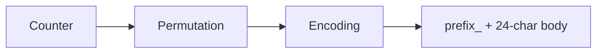
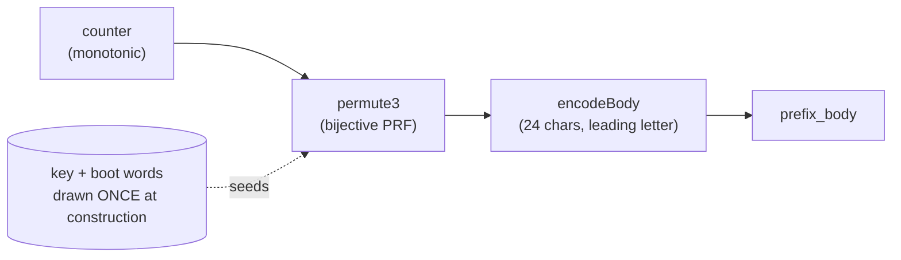
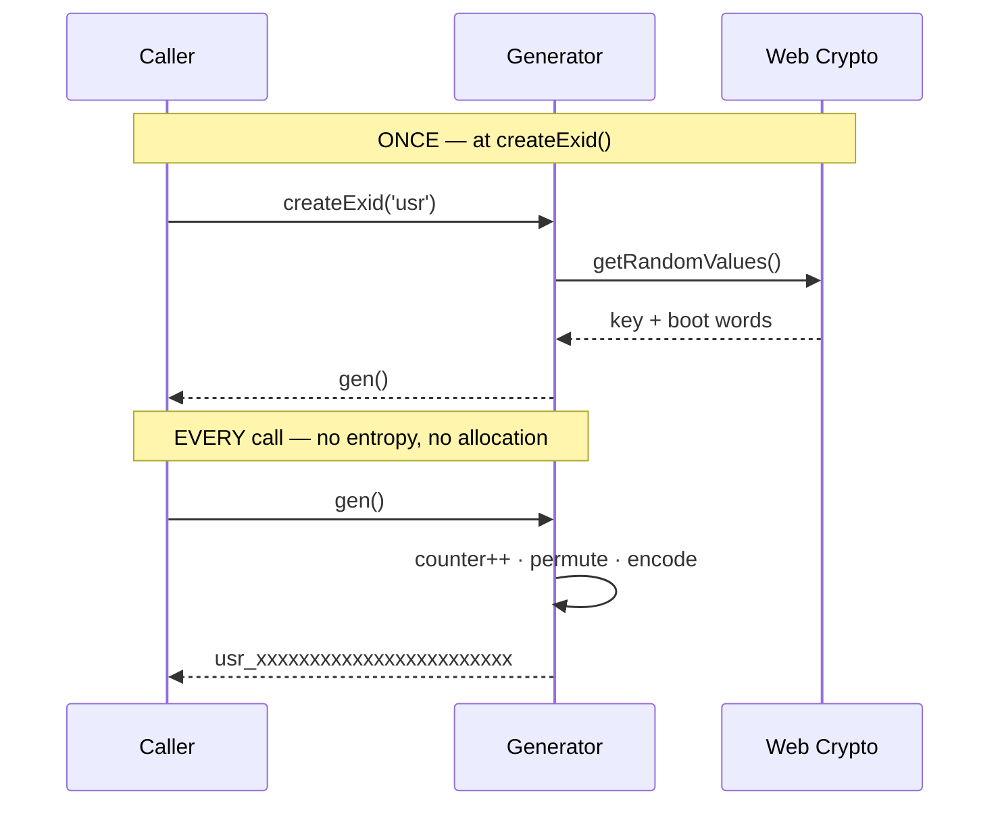
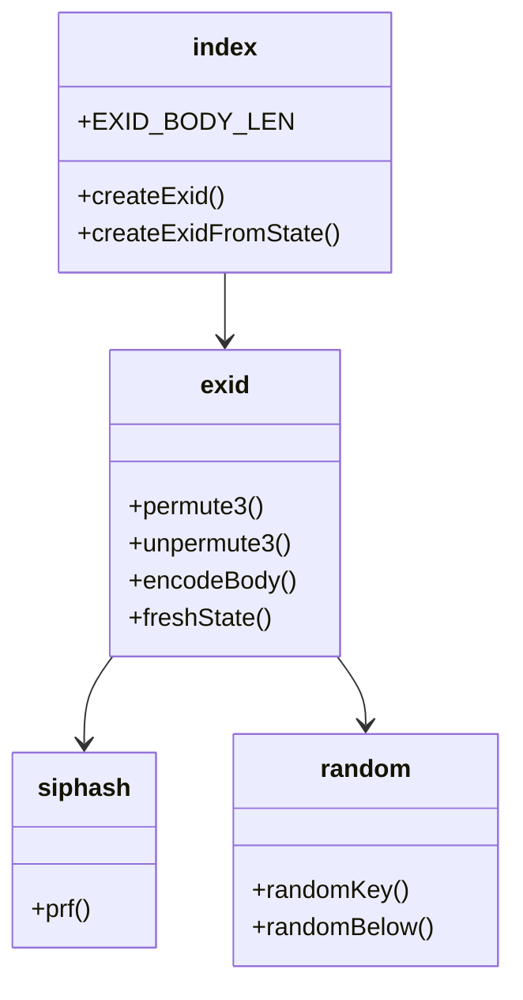

# Mermaid Diagram Patterns

Quick reference for generating Mermaid diagrams in `exid` docs.

## Prefer Mermaid over ASCII art & arrow-text (REQUIRED)

Docs render on GitHub and on npm's README view (which does NOT render Mermaid — see the caption rule below). So any flow, topology, progression, sequence, or lifecycle MUST be a Mermaid diagram — **never** ASCII box-art in a code fence, and **never** a standalone arrow-text line as the primary representation.

**Convert to a diagram when the content is:**

| Content | ❌ Avoid | ✅ Use |
|---|---|---|
| Architecture / service topology | ASCII boxes `┌─┐ │ └─┘ ▼` in a ``` fence | `flowchart TD/LR` (+ `subgraph`, `[( )]` datastores) |
| Progression / tier ladder | `Bronze → Silver → Gold → Platinum` as prose | `flowchart LR` chain |
| Status lifecycle | `DRAFT → ACTIVE → ENDED` as prose | `stateDiagram-v2` |
| Request / API flow, handshake | ASCII arrows between actors | `sequenceDiagram` |
| Decision tree | ASCII branches | `flowchart` with `{condition}` nodes |
| Hierarchy / breakdown | nested ASCII / indented arrows | `flowchart TD` tree |

**Keep as text — do NOT force into Mermaid:**

- **Directory / file trees** — keep as a plain ``` block (Mermaid trees read worse than an indented listing).
- **Tabular data** — use a markdown table, not a diagram.
- **Throwaway inline arrows inside a sentence** — e.g. "the worker marks `PENDING → COMPLETED`" mid-paragraph is fine. Only promote a **standalone** sequence/progression/topology line to a diagram.
- **Detailed UI mockups / wireframes** — an ASCII box framing real UI copy (buttons like `[Copy] [Open]`, labels, badges, progress bars, empty-state CTAs) → keep as the ASCII block; Mermaid has no wireframe primitive and converting loses the fidelity. **But** a *pure page-region or component layout* (header · sidebar · `<main>`; a 3-panel split; a component-nesting tree with no UI copy) IS a topology → convert to a `flowchart` + `subgraph`. Rule of thumb: **contains UI copy → keep; only region/component boxes → convert.**

**House style:**

- Node labels are descriptive text; `<br/>` for multi-line; **`·` as the in-label separator** (reads cleaner than raw `;`/`:` and never collides with Mermaid syntax).
- Datastores / buffers use the cylinder shape: `K[("128-bit key<br/>drawn once")]`.
- **Quote every edge label**: `-->|"cross-origin fetch"|` (bare labels with `+`, `(`, `:` can break the parser).
- Group with `subgraph id[Title]`.
- One concept per diagram; ≤ ~15–20 nodes (split if larger).
- Always keep a **one-line prose caption** near the diagram so meaning survives when the diagram doesn't render (accessibility + skimming).

**There is no automated mermaid validator in this repo** — check the diagram renders on the GitHub PR preview before merging. The frequent parser breakers (all fixed by quoting the label):

| Symptom | Cause | Fix |
|---|---|---|
| `Lexical error … Unrecognized text` | node label starts with `/` or `\` → collides with the `[/…/]` parallelogram shape | `H[/health poll]` → `H["/health poll"]` |
| `Parse error … got 'CALLBACKNAME'` | a `classDef`/class name is a reserved word (`call`, `click`, `href`, `class`) | rename the class — `classDef call` → `classDef svc` |
| `Parse error` on a `{…}` / `{{…}}` node | unquoted `@`, `:`, `(`, `'`, `|`, nested `[]`/`{}` | quote it — `{@AllowLocked}` → `{"@AllowLocked"}` |
| `Parse error` on a `classDef`/`note` line inside `sequenceDiagram` | `classDef`/`class`/`note right of` aren't valid there | delete them (sequence diagrams can't be class-styled) |

### 🔴 The caption is not optional here

`README.md` is rendered by **npm**, which does not render Mermaid at all — a diagram there degrades
to a raw code fence. Every diagram in a file that npm may render needs a one-line prose caption that
carries the meaning on its own.

**Canonical progression example:**



> counter → bijective permutation → base-36 encoding → the prefixed id. *(Keep the arrow sentence as the caption; the diagram carries the visual.)*


---

## Flowchart — the mint pipeline



> Each call advances a counter and pushes it through a bijective permutation — distinct counters
> give distinct ids, which is why same-generator collisions are structurally impossible.

**Style note:** the dotted edge is deliberate — it marks the once-per-generator input, versus the
solid per-call path. Anything that turns that dotted edge into a solid one is a design change.

---

## Sequence — construction vs. mint



> Entropy is drawn once; minting is pure arithmetic. A diagram that shows `getRandomValues` inside
> the per-call block is documenting a bug.

---

## Class — module structure



> `index.ts` is the public surface; everything else is internal and free to change.

---

## Diagram checklist

- [ ] One concept, ≤ ~15 nodes
- [ ] Descriptive labels, `·` as the in-label separator, `<br/>` for multi-line
- [ ] Every edge label quoted
- [ ] A one-line prose caption below it (**required** — npm doesn't render Mermaid)
- [ ] It matches the code, not the code you remember
